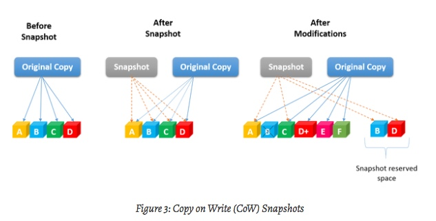

# 03 네이티브 도구와 libvirt 도구를 이용한 명령행 작업

## 2장에서
* /var/lib/lxc/{container-name}/rootfs 를 컨테이너의 루트 파일 시스템으로 사용함
```
/var/lib/lxc/{container-name}/rootfs 디렉토리의 하위 디렉토리를 백업 저장소라고 하며, 'dir', 'lvm', 'loop', 'brtfs', 'zfs', 'rbd', 'best' 를 지정할 수 있다.
기본값은 'dir' 로 컨테이너 루트 파일시스템을 의미한다.
```
* LVM, Brtfs, ZFS 같은 저장소를 사용해 컨테이너 스냅샷과 백업같은 고급기능을 사용할 수 있다.
* 3장에서는 LXC 도구에 대한 대안으로 libvirt 가 제공하는 컨테이너 생성 및 관리를 위한 도구를 살펴볼 것이다.

## 3장에서 배울 내용
* 백업 저장소로 LVM을 사용하는 컨테이너 만들기
* Btrfs 위에서의 LXC
* ZFS를 백업 저장소로 사용하기
* 컨테이너 자동 시작하기
* 컨테이너 훅 추가하기
* 인스턴스의 실행 파일시스템 탐색과 호스트에서의 파일 접근
* 실행중인 컨테이너 고정하기
* 컨테이너의 자원 사용량 제한하기
* libvirt 라이브러리와 도구를 이용해 컨테이너 만들기

## LVM 백업 저장소 사용하기
* LVM = Logical Volume Manager
* [redhat LVM 아키텍처 개요](https://access.redhat.com/documentation/ko-kr/red_hat_enterprise_linux/6/html/logical_volume_manager_administration/lvm_definition)
* 왠지 모르겠지만 우분투 위키가 접근이 안됨..
* 물리적 블록 장치들을 모아 논리적 볼륨으로 전환할 수 있는것
* LVM 을 사용하면 파일시스템의 크기를 증가시키고 싶을때 Physical Volume Pool 에 물리 블록 장치들을 추가만 해주면 된다.
* PV 로부터 Volume Group 을 만들 수 있고, VG는 PV간에 분할, 병합 이동할 수 있다.
* VG는 하나 이상의 LV 로 나워 사용할 수 있다.
* LV 는 여러 디스크에 걸쳐 파일시스템을 생성할 수 있다.
* 새로운 LV 가 원본 LV 의 복사본으로 작동하도록 스냅샷 생성 기능을 허용하기 때문에 LXC 에서 이 기능을 활용해서 컨테이너의 복사본을 빠르게 생성할 수 있다.

* 실습
```sh
# LVM 패키지 설치 (이미 설치됨)
apt install lvm2
# df 로 파일시스템 확인
df -hT
# fdisk 로 파일시스템 확인
fdisk -l /dev/vdb
# fdisk 로 LVM 형식의 파티션 생성 (/dev/vda1 이 루트파일시스템)
fdisk /dev/vdb
# n -> p -> 1 -> 엔터 -> 엔터 -> t -> 8e -> p -> w  순서로 커맨드 입력
```

```
fdisk /dev/vdb

Welcome to fdisk (util-linux 2.27.1).
Changes will remain in memory only, until you decide to write them.
Be careful before using the write command.


Command (m for help): t
Partition number (1,2, default 2): 1
Partition type (type L to list all types): 8e

Changed type of partition 'Linux' to 'Linux LVM'.

Command (m for help): w
```

=====

## 디바이스 새로 연결
```sh
# 볼륨 확인
ll /dev/disk/by-uuid
sudo mount /dev/vdb /data
```

```sh
fdisk -l /dev/vdb
fdisk /dev/vdb
pvcreate /dev/vdb1
vgcreate lxc /dev/vdb1

# lxc 설정
apt update
apt install -y lxc bridge-utils debootstrap libcap-dev

# 프록시 설정
export http_proxy=http://proxy.daumkakao.io:3128
export HTTP_PROXY=$http_proxy
export https_proxy=$http_proxy
export HTTPS_PROXY=$http_proxy

# https://linuxcontainers.org/ko/lxc/manpages/man1/lxc-create.1.html
lxc-create --bdev lvm --fssize 10G --name lvm_container --template ubuntu

lxc-ls -f
NAME          STATE   AUTOSTART GROUPS IPV4 IPV6
lvm_container STOPPED 0         -      -    -

# Physical Volume
pvs
  PV         VG   Fmt  Attr PSize  PFree
  /dev/vdb1  lxc  lvm2 a--  50.00g 40.00g

# Volume Group (앞서 lxc 라는 이름으로 미리 생성함)
vgs
  VG   #PV #LV #SN Attr   VSize  VFree
  lxc    1   1   0 wz--n- 50.00g 40.00g

# Logical Volume
lvs
  LV            VG   Attr       LSize  Pool Origin Data%  Meta%  Move Log Cpy%Sync Convert
  lvm_container lxc  -wi-a----- 10.00g

lxc-start -n lvm_container
lxc-ls -f
  NAME          STATE   AUTOSTART GROUPS IPV4 IPV6
  lvm_container RUNNING 0         -      -    -

# 생성한 lvm_container 의 backend 공간 설정값 확인
cat /var/lib/lxc/lvm_container/config | grep lxc.*.backend
  lxc.rootfs.backend = lvm

# 디바이스 매퍼가 신규로 생성한 블록장치 확인
ls -al /dev/lxc/ | grep lvm
lrwxrwxrwx  1 root root    7 Nov  6 21:36 lvm_container -> ../dm-0
ls -al /dev/mapper/ | grep lvm
lrwxrwxrwx  1 root root       7 Nov  6 21:36 lxc-lvm_container -> ../dm-0

# lvdisplay 명령으로 LV 정보 확인
lvdisplay
  --- Logical volume ---
  LV Path                /dev/lxc/lvm_container
  LV Name                lvm_container
  VG Name                lxc
  LV UUID                SQBxh3-VRtb-EKf3-VLWh-SYwD-d6EY-j2lXU9
  LV Write Access        read/write
  LV Creation host, time container-test03.pg1.krane.9rum.cc, 2018-11-06 21:35:50 +0900
  LV Status              available
  # open                 1
  LV Size                10.00 GiB
  Current LE             2560
  Segments               1
  Allocation             inherit
  Read ahead sectors     auto
  - currently set to     256
  Block device           252:0

```

# LVM 백업 저장소에 컨테이너 스냅샷 만들기

##COW, ROW
###COW (Copy on Write)
- 1~20% 정도의 스냅샷 공간을 미리 할당
- 스냅샷 생성
- 데이터를 복사하지 않고, 포인터로 데이터를 가리키게함
- 원본 데이터가 바뀌면 원본을 읽어(읽기)
- 스냅샷 공간으로 복사(쓰기)
- 원본 데이터에 변경 데이터로 덮어씌움(쓰기)
- 원본 데이터가 바뀔때마다 스냅샷 공간에 복사하므로 오버해드가 크다.(읽기 1번, 쓰기 2번)


###ROW(Redirect on write)
- 스냅샷을 위한 공간을 미리 할당하지 않아도 된다.
- COW처럼 데이터를 포인터로 가리킨다.
- 원본이 변경되려하면, 그 데이터를 스냅샷에 묶어버린다.
- 변경 데이터는 새로운 공간에 할당되고, 포인터가 새로 가리키게된다.


## 스냅샷 생성
lxc-copy --snapshot --name lvm_container_2 --newname container_2_copy

lxc-ls -f

lvs

Attr 열을 보면 스냅샷임을 나태는 s속성이 붙어있음을 알 수 있다.
--snapshot 속성을 지정 안 하면, 원본 컨테이너 파일시스템 전체 복사


